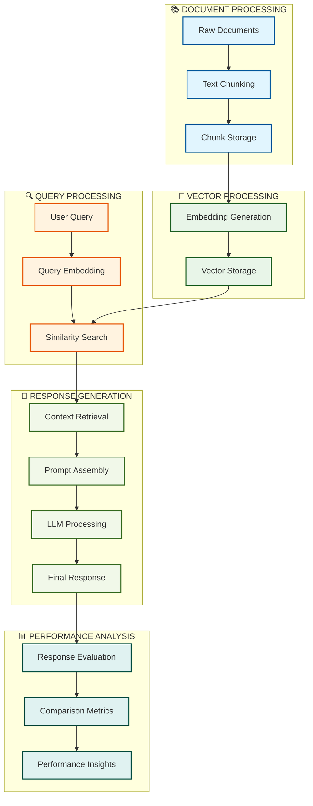
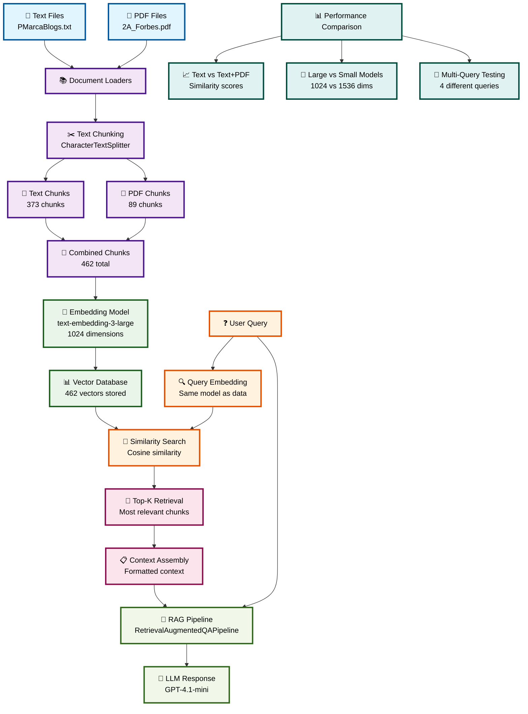

# RAG System Flow Diagram

## Main Process Flow

## Detailed Component Flow

## Color Legend

- 🔵 **Blue**: Data Input (Files, Loaders)
- 🟢 **Green**: Processing (Chunking, Combining)
- 🟡 **Yellow**: Embedding (Models, Vectors)
- 🔴 **Red**: Query Processing (Search, Retrieval)
- 🟣 **Purple**: LLM Processing (Generation, Response)
- 🟦 **Teal**: Analysis (Comparison, Metrics)

## Key Dependencies

1. **Sequential Data Flow**: Files → Loaders → Chunks → Embeddings → Vectors → Search → Response
2. **Model Consistency**: Same embedding model for data and queries
3. **Pipeline Requirements**: RAG needs Vector DB + LLM + Prompts
4. **Component Dependencies**: Each step depends on the previous step completing
