# RAG System Flow Diagram

## Main Process Flow

```mermaid
graph TB
    subgraph "📚 DOCUMENT PROCESSING"
        A[Raw Documents] --> B[Text Chunking]
        B --> C[Chunk Storage]
    end
    
    subgraph "🧠 VECTOR PROCESSING"
        C --> D[Embedding Generation]
        D --> E[Vector Storage]
    end
    
    subgraph "🔍 QUERY PROCESSING"
        F[User Query] --> G[Query Embedding]
        G --> H[Similarity Search]
        E --> H
    end
    
    subgraph "🤖 RESPONSE GENERATION"
        H --> I[Context Retrieval]
        I --> J[Prompt Assembly]
        J --> K[LLM Processing]
        K --> L[Final Response]
    end
    
    subgraph "📊 PERFORMANCE ANALYSIS"
        L --> M[Response Evaluation]
        M --> N[Comparison Metrics]
        N --> O[Performance Insights]
    end
    
    %% Styling
    classDef doc fill:#e1f5fe,stroke:#01579b,stroke-width:2px
    classDef vec fill:#e8f5e8,stroke:#1b5e20,stroke-width:2px
    classDef query fill:#fff3e0,stroke:#e65100,stroke-width:2px
    classDef response fill:#f1f8e9,stroke:#33691e,stroke-width:2px
    classDef analysis fill:#e0f2f1,stroke:#004d40,stroke-width:2px
    
    class A,B,C doc
    class D,E vec
    class F,G,H query
    class I,J,K,L response
    class M,N,O analysis
```

## Detailed Component Flow

```mermaid
flowchart TD
    %% Data Input Layer
    A[📄 Text Files<br/>PMarcaBlogs.txt] --> C[📚 Document Loaders]
    B[📄 PDF Files<br/>2A_Forbes.pdf] --> C
    
    %% Document Processing Layer
    C --> D[✂️ Text Chunking<br/>CharacterTextSplitter]
    D --> E[📝 Text Chunks<br/>373 chunks]
    D --> F[📝 PDF Chunks<br/>89 chunks]
    E --> G[🔗 Combined Chunks<br/>462 total]
    F --> G
    
    %% Embedding Layer
    G --> H[🧠 Embedding Model<br/>text-embedding-3-large<br/>1024 dimensions]
    H --> I[📊 Vector Database<br/>462 vectors stored]
    
    %% Query Processing Layer
    J[❓ User Query] --> K[🔍 Query Embedding<br/>Same model as data]
    K --> L[📐 Similarity Search<br/>Cosine similarity]
    I --> L
    
    %% Retrieval Layer
    L --> M[🎯 Top-K Retrieval<br/>Most relevant chunks]
    M --> N[📋 Context Assembly<br/>Formatted context]
    
    %% LLM Processing Layer
    N --> O[🤖 RAG Pipeline<br/>RetrievalAugmentedQAPipeline]
    J --> O
    O --> P[💬 LLM Response<br/>GPT-4.1-mini]
    
    %% Comparison & Analysis Layer
    Q[📊 Performance Comparison] --> R[📈 Text vs Text+PDF<br/>Similarity scores]
    Q --> S[🔬 Large vs Small Models<br/>1024 vs 1536 dims]
    Q --> T[🧪 Multi-Query Testing<br/>4 different queries]
    
    %% Styling with Colors
    classDef input fill:#e1f5fe,stroke:#01579b,stroke-width:3px,color:#000
    classDef process fill:#f3e5f5,stroke:#4a148c,stroke-width:3px,color:#000
    classDef embedding fill:#e8f5e8,stroke:#1b5e20,stroke-width:3px,color:#000
    classDef query fill:#fff3e0,stroke:#e65100,stroke-width:3px,color:#000
    classDef retrieval fill:#fce4ec,stroke:#880e4f,stroke-width:3px,color:#000
    classDef llm fill:#f1f8e9,stroke:#33691e,stroke-width:3px,color:#000
    classDef comparison fill:#e0f2f1,stroke:#004d40,stroke-width:3px,color:#000
    
    class A,B input
    class C,D,E,F,G process
    class H,I embedding
    class J,K,L query
    class M,N retrieval
    class O,P llm
    class Q,R,S,T comparison
```

## Color Legend

- 🔵 **Blue**: Data Input (Files, Loaders)
- 🟢 **Green**: Processing (Chunking, Combining)
- 🟡 **Yellow**: Embedding (Models, Vectors)
- 🔴 **Red**: Query Processing (Search, Retrieval)
- 🟣 **Purple**: LLM Processing (Generation, Response)
- 🟦 **Teal**: Analysis (Comparison, Metrics)

## Key Dependencies

1. **Sequential Data Flow**: Files → Loaders → Chunks → Embeddings → Vectors → Search → Response
2. **Model Consistency**: Same embedding model for data and queries
3. **Pipeline Requirements**: RAG needs Vector DB + LLM + Prompts
4. **Component Dependencies**: Each step depends on the previous step completing
