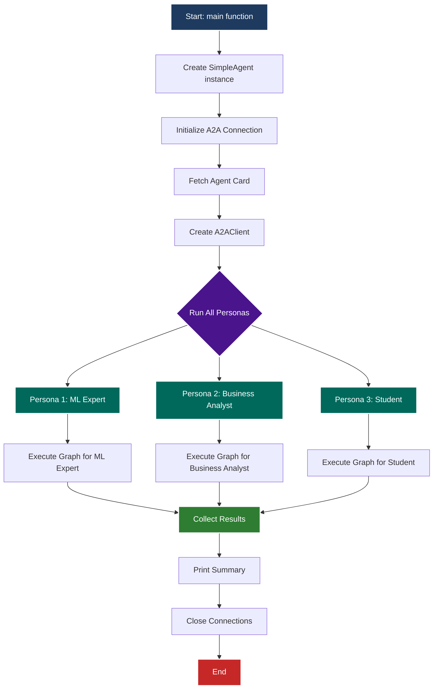
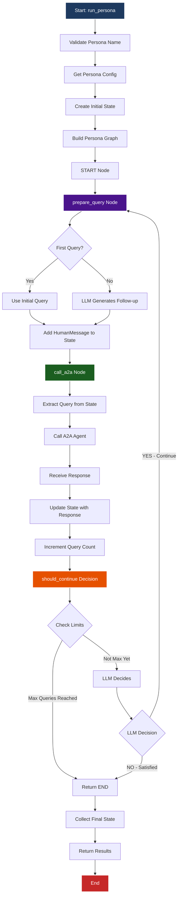
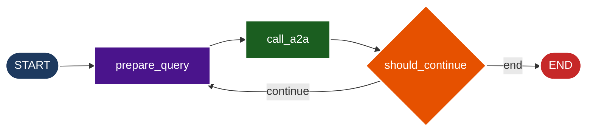
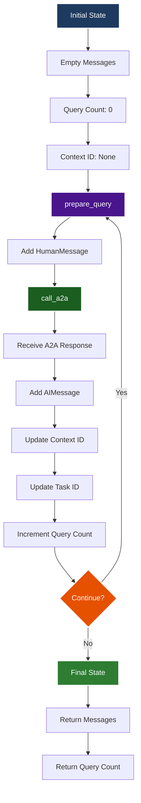

# Simple Agent with 3 Personas - Documentation

## Overview

The `simple_agent.py` file creates a **Simple Agent** with **3 personas** that interact with an A2A protocol agent using **LangGraph**. Each persona has distinct personalities, goals, and communication styles, demonstrating how different users might interact with the same AI agent system.

## Key Implementation Details

### Task ID Handling
- **First query**: No `task_id` or `context_id` (starts new task)
- **Follow-up queries**: Only `context_id` is used (starts new task, maintains context)
- **Why**: Once a task completes, its `task_id` becomes invalid. Reusing it causes "Task is in terminal state: completed" errors.

### Error Handling
- Detects `JSONRPCErrorResponse` before accessing `.result` attribute
- Uses consolidated helper functions for error and text extraction
- Graceful degradation with multiple fallback methods

---

## Table of Contents

1. [Global Constants & Data Structures](#global-constants--data-structures)
2. [Class: SimpleAgent](#class-simpleagent)
3. [Main Entry Point](#main-entry-point)
4. [Execution Flow Diagram](#execution-flow-diagram)
5. [Key Design Patterns](#key-design-patterns)

---

## Global Constants & Data Structures

### `PERSONAS` (Lines 27-64)

A dictionary that defines the 3 personas:

- **`ml_expert`**: Machine Learning researcher who wants technical details and sources
- **`business_analyst`**: Business-focused persona who wants practical insights and ROI
- **`student`**: Student who wants accessible educational explanations

Each persona contains:
- **`name`**: Display name for the persona
- **`system_instruction`**: Personality description and goals
- **`initial_query`**: The first question this persona will ask

### `PersonaState` (Lines 67-76)

A TypedDict that holds the conversation state throughout the graph execution:

- **`messages`**: List of conversation messages (HumanMessage and AIMessage)
- **`persona`**: Current persona name
- **`persona_config`**: Full persona configuration dictionary
- **`a2a_response`**: Latest response received from A2A agent
- **`context_id`** & **`task_id`**: For maintaining multi-turn conversation context
- **`query_count`**: Number of queries made so far
- **`max_queries`**: Maximum queries allowed per persona

---

## Class: SimpleAgent

### `__init__()` (Lines 82-104)

**Purpose**: Initializes the SimpleAgent instance.

**Parameters**:
- `a2a_base_url`: Base URL of the A2A agent server (default: `http://localhost:10000`)
- `max_queries_per_persona`: Maximum number of queries each persona can make (default: 3)

**What it does**:
- Stores configuration settings
- Initializes a `ChatOpenAI` model for persona reasoning (temperature 0.7 for more creative responses)
- Sets client variables to `None` (will be initialized later)

---

### `initialize()` (Lines 106-124)

**Purpose**: Sets up the A2A client connection.

**What it does**:
- Creates an `httpx.AsyncClient` with a 60-second timeout
- Creates an `A2ACardResolver` to fetch the agent card from the server
- Fetches the agent card from the A2A server endpoint
- Creates an `A2AClient` using the fetched agent card
- Logs success/failure messages

**Why it's needed**: The A2A protocol requires fetching the agent's "card" (metadata) before communication can begin.

---

### `call_a2a_agent()` (Lines 131-280)

**Purpose**: Sends a query to the A2A agent and returns the response.

**Parameters**:
- `query`: The question to send to the A2A agent
- `context_id`: Optional context ID for multi-turn conversations
- `task_id`: Optional task ID (kept for API compatibility, but **not used** for follow-up queries)

**Important**: `task_id` is **not sent** for follow-up queries because:
- After the first query completes, the task enters a "completed" (terminal) state
- Reusing a completed `task_id` causes: `"Task is in terminal state: completed"` error
- Each follow-up query starts a **new task** but maintains conversation context via `context_id`

**What it does**:
1. Ensures A2A client is initialized (calls `initialize()` if needed)
2. Builds the message payload with query and `context_id` (but **not** `task_id` for follow-ups)
3. Creates a `SendMessageRequest` object
4. Sends the request via `A2AClient.send_message()`
5. Converts response to dict using `response.model_dump(mode='json', exclude_none=True)` (same as `test_client.py`)
6. **Checks for errors FIRST** using helper function `extract_error_message()` to prevent AttributeError
7. Extracts `context_id` from response (but **not** `task_id`)
8. Extracts response text from artifacts using helper function `extract_text_from_artifacts()`
9. Returns a tuple: `(response_text, context_id, task_id)` where `task_id` is `None`

**Error Handling**:
- Uses `extract_error_message()` helper to consolidate error extraction logic
- Checks for error responses before accessing `.result` (prevents AttributeError)
- Detects `JSONRPCErrorResponse` by type name and error attribute
- Returns error message as response text if error detected

**Response Extraction Strategy** (matching `test_client.py` pattern):
1. **Primary method**: Uses `model_dump()` to convert response to dict, then uses `extract_text_from_artifacts()` helper:
   - `response_dict['root']['result']['artifacts']` → `parts` → `root` → `text`
2. **Fallback method**: Direct attribute access using same helper function:
   - `response.root.result.artifacts[]` → helper extracts text
3. **Last resort**: Regex extraction from JSON string if other methods fail

**Helper Functions**:
- `extract_error_message()`: Consolidates error message extraction from various formats
- `extract_text_from_artifacts()`: Handles both dict and object structures for artifact text extraction

This approach follows the same pattern as `test_client.py`, ensuring consistency and reliability while avoiding the task_id reuse issue.

---

### `build_persona_graph()` (Lines 226-361)

**Purpose**: Builds the LangGraph that orchestrates persona interactions with the A2A agent.

**Returns**: A compiled LangGraph ready for execution.

#### Inner Function: `prepare_query()` (Lines 229-268)

**Purpose**: Generates the next query based on persona personality and conversation history.

**What it does**:
- **First query**: Uses the persona's predefined `initial_query`
- **Follow-up queries**: Uses the LLM to generate contextually appropriate questions based on:
  - Persona's system instructions
  - Previous conversation history
  - Persona's goals and personality
- Adds the generated query as a `HumanMessage` to the state

**Why it's smart**: The LLM generates questions that match each persona's style (technical vs. business vs. educational).

#### Inner Function: `call_a2a_node()` (Lines 270-294)

**Purpose**: Calls the A2A agent with the prepared query.

**What it does**:
- Extracts the last message (the query) from the state
- Calls `call_a2a_agent()` with the query and context (which uses the improved response extraction)
- Updates the state with:
  - Response text from A2A agent (extracted using `model_dump()` pattern)
  - New `context_id` and `task_id` for next turn
  - Adds an `AIMessage` with the response
  - Increments `query_count`

**Logging**: Logs the query and response for debugging.

#### Inner Function: `should_continue()` (Lines 296-345)

**Purpose**: Decides whether to continue the conversation or end it.

**What it does**:
- **Hard limit**: Stops if `query_count >= max_queries`
- **Empty response check**: Ends if response is empty
- **JSON detection**: Detects if response extraction failed (raw JSON detected)
- **Smart decision**: Uses the LLM to decide if the persona wants to ask more questions based on:
  - Persona's personality and goals
  - The last response received (limited to 1000 chars for prompt efficiency)
- Returns `"continue"` or `"end"`
- **Error handling**: Detects API key errors and provides helpful error messages

**Why it's smart**: Each persona decides independently whether they're satisfied with the answer or want to dig deeper, with safeguards against extraction failures.

#### Graph Construction (Lines 347-361)

**Purpose**: Assembles the LangGraph with nodes and edges.

**Graph Structure**:
```
START → prepare_query → call_a2a → (should_continue?)
                              ↓
                    continue? → prepare_query (loop)
                              ↓
                    end? → END
```

**Nodes**:
- `prepare_query`: Generates the next question
- `call_a2a`: Queries the A2A agent

**Edges**:
- `START` → `prepare_query`: Begin with first query
- `prepare_query` → `call_a2a`: Always call A2A after preparing query
- `call_a2a` → `prepare_query` or `END`: Conditional based on `should_continue()`

---

### `run_persona()` (Lines 363-412)

**Purpose**: Runs a single persona through a complete conversation.

**Parameters**:
- `persona_name`: One of `'ml_expert'`, `'business_analyst'`, or `'student'`

**What it does**:
1. Validates the persona name exists in `PERSONAS`
2. Gets the persona configuration
3. Creates initial state with empty messages
4. Builds the persona graph
5. Streams the graph execution (async)
6. Collects the final state after execution
7. Returns results dictionary with:
   - Persona name and display name
   - All conversation messages
   - Total query count

**Logging**: Logs conversation start, progress, and completion.

---

### `run_all_personas()` (Lines 414-429)

**Purpose**: Runs all 3 personas sequentially.

**What it does**:
- Iterates through all personas in the `PERSONAS` dictionary
- Calls `run_persona()` for each persona
- Handles errors gracefully (continues if one persona fails)
- Returns a list of results (one per persona)

**Error Handling**: If a persona fails, it logs the error and continues with the next persona.

---

### `close()` (Lines 431-434)

**Purpose**: Cleans up resources.

**What it does**:
- Closes the `httpx.AsyncClient` connection to free resources

**Why it's important**: Proper cleanup prevents resource leaks.

---

## Main Entry Point

### `main()` (Lines 437-473)

**Purpose**: Main orchestrator function that runs everything.

**What it does**:
1. Prints welcome message and instructions
2. Creates a `SimpleAgent` instance (max 3 queries per persona)
3. Initializes the A2A connection
4. Runs all personas using `run_all_personas()`
5. Prints a summary of results showing:
   - Success/failure for each persona
   - Number of queries made
6. Handles errors gracefully
7. Ensures cleanup by calling `close()`

### `if __name__ == "__main__"` (Lines 475-476)

**Purpose**: Entry point when script is run directly.

**What it does**: Runs `main()` using `asyncio.run()` to handle async execution.

---

## Execution Flow Diagram

### Overall Flow: Running All 3 Personas



### Single Persona Execution Flow



### LangGraph Structure



### Data Flow: State Management



---

## Key Design Patterns

### 1. **State Management**
- Uses `PersonaState` TypedDict to maintain conversation state throughout graph execution
- State is immutable - each node returns updated state
- LangGraph automatically merges state updates

### 2. **LangGraph Orchestration**
- Graph controls the conversation flow automatically
- Nodes are async functions that process state
- Conditional edges enable dynamic routing

### 3. **Persona-Driven Queries**
- LLM generates questions based on persona personality
- Each persona asks different types of questions
- Maintains persona consistency throughout conversation

### 4. **Multi-Turn Conversations**
- Uses `context_id` to maintain conversation context across queries
- **Important**: Does NOT reuse `task_id` for follow-up queries (each query starts a new task)
- Once a task completes, its `task_id` becomes invalid (terminal state)
- `context_id` maintains conversation history across new tasks
- A2A protocol supports context-aware responses via `context_id`
- State tracks conversation history

### 5. **Error Handling**
- Graceful degradation if one persona fails
- Continues execution even with errors
- Logs errors for debugging
- **Consolidated error extraction**: Uses `extract_error_message()` helper function
- **Proactive error detection**: Checks for errors before accessing `.result` attribute
- Handles `JSONRPCErrorResponse` gracefully

### 6. **Code Organization**
- **Helper functions**: Consolidates duplicate logic (error extraction, text extraction)
- **DRY principle**: No redundant code blocks
- **Clean imports**: Only imports what's actually used
- **Maintainable**: Clear separation of concerns

### 7. **Resource Management**
- Proper async/await usage
- HTTP client cleanup
- Connection pooling for efficiency

---

## Usage Example

```bash
# Make sure the A2A agent server is running first
uv run python -m app

# In another terminal, run the simple agent
uv run python simple_agent.py
```

### Expected Output

```
🚀 Simple Agent with 3 Personas
============================================================

This agent will demonstrate 3 different personas interacting
with the A2A agent through LangGraph.

[INFO] Fetching agent card from http://localhost:10000
[INFO] Successfully fetched agent card
[INFO] A2A client initialized

============================================================
Starting conversation with Dr. Sarah Chen - ML Expert
============================================================

[ml_expert] Querying A2A agent: What are the latest developments...
[ml_expert] Received response: Based on recent research...

============================================================
Conversation with Dr. Sarah Chen - ML Expert completed
Total queries: 3
============================================================

... (similar output for other personas)

============================================================
SUMMARY
============================================================
✅ Dr. Sarah Chen - ML Expert
   Queries made: 3

✅ Alex Martinez - Business Analyst
   Queries made: 2

✅ Jordan Kim - Curious Student
   Queries made: 3
```

---

## Customization

### Adding a New Persona

1. Add a new entry to the `PERSONAS` dictionary:

```python
PERSONAS = {
    # ... existing personas ...
    "new_persona": {
        "name": "Your Persona Name",
        "system_instruction": "Personality and goals description...",
        "initial_query": "First question to ask...",
    },
}
```

2. The agent will automatically include it when running all personas.

### Adjusting Query Limits

```python
agent = SimpleAgent(max_queries_per_persona=5)  # Allow more queries
```

### Changing A2A Server URL

```python
agent = SimpleAgent(a2a_base_url="http://your-server:port")
```

---

## Architecture Benefits

1. **Modularity**: Each persona is independent and can be run separately
2. **Scalability**: Easy to add more personas or modify existing ones
3. **Maintainability**: Clear separation of concerns (graph building, state management, A2A communication)
4. **Testability**: Each function has a single responsibility
5. **Flexibility**: Graph structure allows easy modification of conversation flow

---

## Troubleshooting

### Connection Errors
- Ensure the A2A agent server is running on the expected port
- Check that `a2a_base_url` matches the server address

### "Task is in terminal state: completed" Error
**Symptom**: Error occurs on 2nd or 3rd query in a conversation

**Cause**: This was a known issue that has been **fixed**. The code now:
- Does NOT send `task_id` for follow-up queries
- Only uses `context_id` to maintain conversation context
- Each follow-up query starts a new task automatically

**Solution**: The fix is already in place. If you see this error, ensure you're using the latest version of `simple_agent.py`.

### Response Extraction Issues
- The `call_a2a_agent()` function has multiple fallback methods for extracting responses
- Uses helper functions `extract_text_from_artifacts()` for consistent extraction
- Check logs for detailed response structure if issues occur

### JSONRPCErrorResponse Errors
**Symptom**: Error: `'JSONRPCErrorResponse' object has no attribute 'result'`

**Cause**: Trying to access `.result` on an error response object

**Solution**: The code now checks for errors **before** accessing `.result`. Error detection uses:
- Response type name checking
- Error attribute detection
- Dict structure fallback

### Persona Not Asking Questions
- Check that `max_queries_per_persona` is set correctly
- Verify persona's `system_instruction` is clear and motivating
- Check LLM API key is set correctly in `.env` file
- Ensure `OPENAI_API_KEY` is not a placeholder value

---

## Code Quality Improvements

The code has been optimized for maintainability and reliability:

### Removed Redundancies
- ✅ Removed unused imports (`AgentCard`, `AGENT_CARD_WELL_KNOWN_PATH`, `EXTENDED_AGENT_CARD_PATH`)
- ✅ Consolidated error extraction into `extract_error_message()` helper
- ✅ Consolidated text extraction into `extract_text_from_artifacts()` helper
- ✅ Simplified error checking logic (from 3 separate blocks to 2 with shared helper)

### Critical Fixes
- ✅ **Task ID handling**: Fixed "Task is in terminal state: completed" error by not sending `task_id` for follow-ups
- ✅ **Error detection**: Fixed `'JSONRPCErrorResponse' object has no attribute 'result'` by checking errors first
- ✅ **Response extraction**: Improved reliability with consolidated helper functions

### Code Organization
- ✅ Helper functions improve readability and maintainability
- ✅ Clear comments explaining why `task_id` is not used
- ✅ Consistent error handling patterns

---

## Future Enhancements

Potential improvements:
- Add streaming support for real-time response display
- Implement persona-specific timeout settings
- Add conversation history persistence
- Support for parallel persona execution
- Enhanced error recovery mechanisms
- Conversation quality metrics

